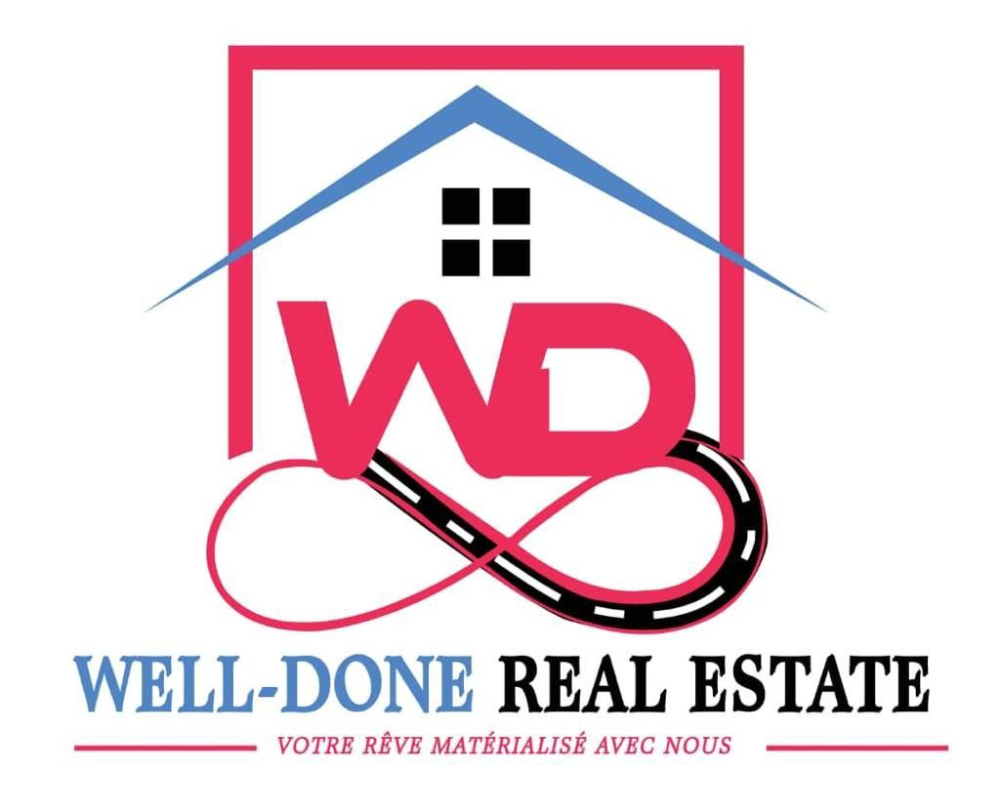

 

## About Project 
  ### immobilière WELL- DONE REAL ESTATE 
        L’entreprise immobilière WELL- DONE REAL ESTATE est active dans l’achat des terrains, L’architecture
        la construction et la finition des maisons. Elle souhaite développer un site web vitrine pour Présenter ses activités
        et ses réalisations afin d’attirer de nouveaux clients et d’assoie sa notoriété dans la région.

## Features

- Site vitrine / Présentation de l'Entreprise 
- Gestion de messagerie 
- Gestion des utilisateurs (admin)
- CRUD des propriétés (Catalogue de réalisation )

## Actors
     -ADministrators
     -public (internautes ou potentiels clients)

## Objectives
    -  Présenter de manière attractive et engageante l’expertise et le portefeuille de réalisation de l’entreprise dans ses différents domaines d’activités (achats fonciers, architectures, construction, finition).
    -  Mettre en avant les projets immobiliers récents et les témoignages clients positifs ; pour démontrer la qualité et la fiabilité de l’entreprise.
    -  Faciliter la prise de contact des nouveaux clients via des formulaires de contact.
    -  Améliorer significativement la visibilité du site web.
    -  Offrir une expérience utilisateur intuitive et agréable.

## Framework used

Laravel is a web application framework with expressive, elegant syntax. We believe development must be an enjoyable and creative experience to be truly fulfilling. Laravel takes the pain out of development by easing common tasks used in many web projects, such as:

- [Simple, fast routing engine](https://laravel.com/docs/routing).
- [Powerful dependency injection container](https://laravel.com/docs/container).
- Multiple back-ends for [session](https://laravel.com/docs/session) and [cache](https://laravel.com/docs/cache) storage.
- Expressive, intuitive [database ORM](https://laravel.com/docs/eloquent).
- Database agnostic [schema migrations](https://laravel.com/docs/migrations).
- [Robust background job processing](https://laravel.com/docs/queues).
- [Real-time event broadcasting](https://laravel.com/docs/broadcasting).

