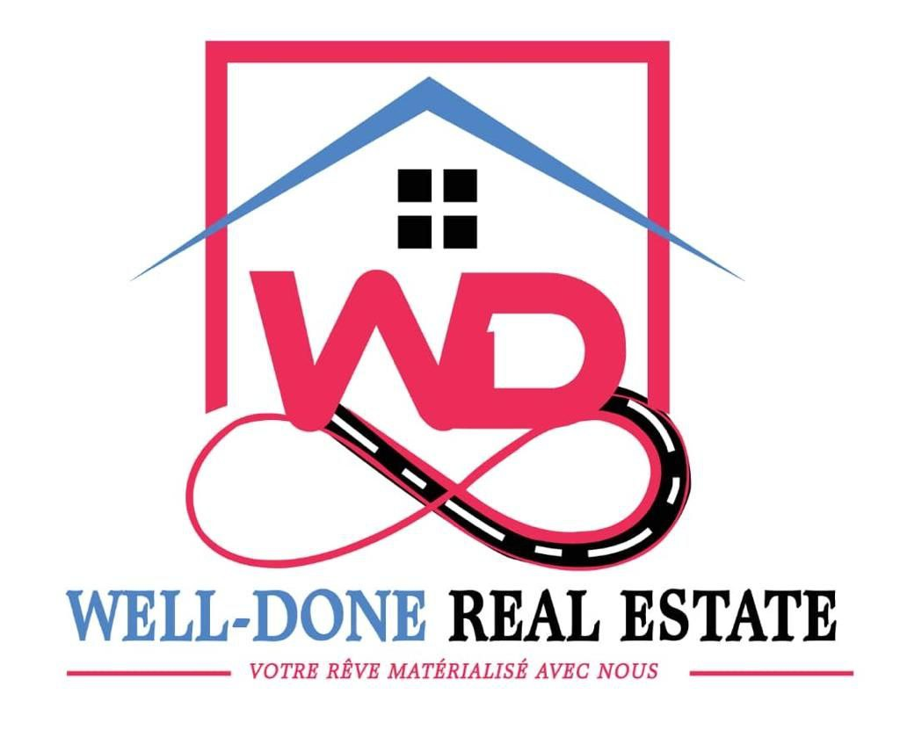

    

    
    
    
    

    🔗 <a href="https://welldonerealestatesci.com" target="_blank">Site officiel WELL-DONE REAL ESTATE</a> 
    Le projet est actuellement déployé sur le nom de domaine : <strong>welldonerealestatesci.com</strong>

---

## À propos du projet

### WELL-DONE REAL ESTATE

WELL-DONE REAL ESTATE est une entreprise spécialisée dans l’achat de terrains, l’architecture, la construction et la finition de maisons. Ce projet vise à développer un site web vitrine moderne pour présenter ses activités, valoriser ses réalisations, attirer de nouveaux clients et renforcer sa notoriété régionale.

> **Aucune base de données n'est nécessaire pour débuter avec le lancement de ce projet.**

---

## Fonctionnalités principales

| Fonctionnalité                                                                 | Acteurs concernés         |
|-------------------------------------------------------------------------------|--------------------------|
| Présentation de l'entreprise et de ses services                               | Public                   |
| Mise en avant des réalisations et projets immobiliers                         | Public                   |
| Gestion de messagerie (formulaire de contact)                                 | Public, Administrateurs  |
| Gestion des utilisateurs (administration)                                     | Administrateurs          |
| CRUD des propriétés (catalogue des réalisations)                              | Administrateurs          |
| Indexation sur les moteurs de recherche (Google Search Console)               | Public, Administrateurs  |
| Responsive design et accessibilité                                            | Public                   |

---

## Technologies et packages utilisés

- **Framework principal** : [Laravel 10.x](https://laravel.com/)
- `laravel/framework`
- `fideloper/proxy`
- `fruitcake/laravel-cors`
- `guzzlehttp/guzzle`
- `laravel/tinker`
- *(Ajoutez ici tout autre package spécifique utilisé dans votre projet)*

---

## Public cible

Le site s’adresse principalement :
- Aux clients potentiels recherchant des biens immobiliers ou des services de construction
- Aux administrateurs de l’entreprise pour la gestion du contenu et des réalisations

---

## Indexation et visibilité

Le site est indexé sur les moteurs de recherche (Google Search Console), ce qui améliore sa visibilité, optimise le référencement naturel (SEO) et facilite l’accès des clients via les recherches en ligne.

---

## Objectifs du projet

- Présenter de manière attractive l’expertise et le portefeuille de réalisations de l’entreprise
- Mettre en avant les projets récents et les témoignages clients pour démontrer la qualité et la fiabilité
- Faciliter la prise de contact via des formulaires adaptés
- Améliorer la visibilité du site grâce à l’indexation SEO
- Offrir une expérience utilisateur intuitive, agréable et responsive

---

## Design et expérience utilisateur

Le design du site est pensé pour :
- Une navigation claire et intuitive
- Une présentation élégante et professionnelle des contenus
- Une lisibilité optimale sur tous les supports (responsive design)
- Une accessibilité renforcée pour tous les utilisateurs

---

## Pourquoi Laravel ?

Laravel est un framework web moderne et expressif, facilitant le développement grâce à :
- [Moteur de routage simple et rapide](https://laravel.com/docs/routing)
- [Conteneur d’injection de dépendances puissant](https://laravel.com/docs/container)
- Prise en charge de multiples back-ends pour [sessions](https://laravel.com/docs/session) et [cache](https://laravel.com/docs/cache)
- [ORM de base de données intuitif](https://laravel.com/docs/eloquent)
- [Migrations de schéma agnostiques](https://laravel.com/docs/migrations)
- [Traitement robuste des tâches en arrière-plan](https://laravel.com/docs/queues)
- [Diffusion d’événements en temps réel](https://laravel.com/docs/broadcasting)

---

## Contribution

Les contributions sont les bienvenues ! N’hésitez pas à proposer des améliorations ou à signaler des problèmes via les issues du dépôt.

---

## Licence

Ce projet est distribué sous licence [MIT](https://opensource.org/licenses/MIT).

